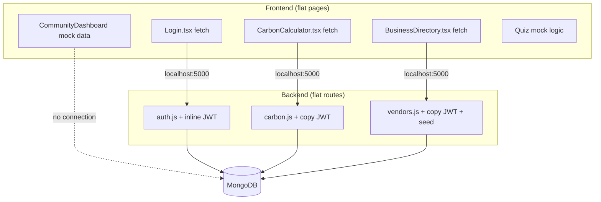
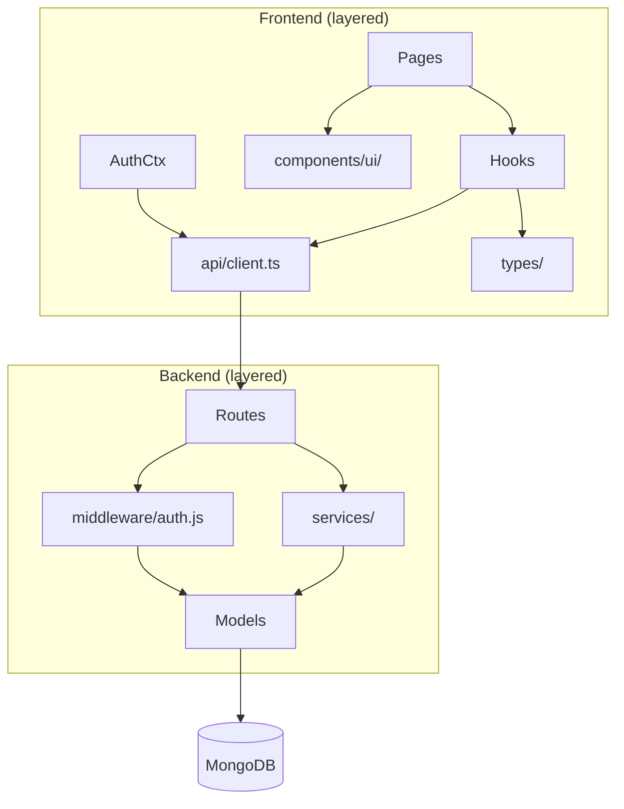

# Untitled

# EcoMatch Structural Diagnosis & Correction Plan

Full codebase audit (~46 tracked files): CRA React 19 + TypeScript frontend, Express + MongoDB backend in `server/`. The app works as a prototype, but several structural issues block production use, create security risk, and will cause pain as the codebase grows.

---

## Executive Summary

| Area | Verdict |
| --- | --- |
| **Architecture** | Flat, page-centric frontend; routes-only backend — no shared layers |
| **Security** | Critical gaps (public seed endpoint, client-trusted carbon values, open CORS) |
| **Deployability** | Broken — hardcoded `localhost:5000`, no env config, no CI |
| **Maintainability** | High debt — 4 page files at 340–518 lines, duplicated auth middleware, duplicated UI |
| **Testing** | Effectively none — 1 stale CRA test that fails; zero automated backend tests |
| **Type safety** | Frontend `strict: true` undermined by `any` and wrong ID types |

---

## Part 1: All Structural Issues (By Category)

### 🔴 CRITICAL — Security & Data Integrity

| # | Issue | Location | Impact |
| --- | --- | --- | --- |
| C1 | **Public unauthenticated seed endpoint** | `server/routes/vendors.js` L102 | Anyone can bulk-insert data into production DB |
| C2 | **Carbon footprint trusted from client** | `server/routes/carbon.js` POST handler | Users can submit arbitrary values; no server-side calculation |
| C3 | **JWT middleware missing `return` after errors** | `carbon.js` L20–27, `vendors.js`, `auth.js` L94–96 | Can send double HTTP responses → crashes / unpredictable auth |
| C4 | **Internal error messages leaked to clients** | All route `catch` blocks | Mongoose/stack traces exposed via `error.message` |
| C5 | **CORS fully open** | `server/server.js` | Any origin can call your API |
| C6 | **No `JWT_SECRET` validation at startup** | `server/server.js` | Server starts with undefined secret → silent auth failure |
| C7 | **`read_secret.js` in repo** | `server/read_secret.js` | Debug script that prints secrets to stdout |
| C8 | **JWT in localStorage** | `src/context/AuthContext.tsx` | XSS → token theft; no server-side session revocation |

### 🔴 CRITICAL — Deployment Blockers

| # | Issue | Location | Impact |
| --- | --- | --- | --- |
| D1 | **Hardcoded API URL** | `Login.tsx`, `Register.tsx`, `BusinessDirectory.tsx`, `CarbonCalculator.tsx` | App breaks outside local dev |
| D2 | **No `.env.example`** | Root + `server/` | New devs / deploy pipelines can't configure the app |
| D3 | **No CI/CD** | No `.github/workflows/` | Nothing validates builds, tests, or security on PRs |
| D4 | **Broken default test** | `src/App.test.tsx` | Asserts "learn react" — text that doesn't exist |

### 🟠 HIGH — Architecture & Coupling

| # | Issue | Location | Impact |
| --- | --- | --- | --- |
| A1 | **No shared API client layer** | All API pages | 6+ raw `fetch` calls with duplicated headers/error handling |
| A2 | **JWT auth middleware copy-pasted 3×** | `auth.js`, `carbon.js`, `vendors.js` | Bug fixes must be applied in 3 places |
| A3 | **No service/controller layer on backend** | `server/routes/*` | HTTP + business logic + DB access mixed in route handlers |
| A4 | **Frontend/backend type split** | TS frontend, JS backend | No shared contracts; DTO mapping with `any` |
| A5 | **Page monoliths (340–518 lines)** | `CommunityDashboard`, `CarbonCalculator`, `SustainabilityQuiz`, `BusinessDirectory` | Untestable, hard to review, hard to reuse |
| A6 | **No route protection on frontend** | `App.tsx` | `/calculator` uses inline `alert`; no `ProtectedRoute` |
| A7 | **Token never re-validated** | `AuthContext` loads from localStorage; `/api/auth/me` unused | Stale/expired tokens treated as valid until API fails |
| A8 | **Two independent npm projects, no orchestration** | Root + `server/` | No single `npm run dev` for full stack |

### 🟠 HIGH — Data & API Contract Issues

| # | Issue | Location | Impact |
| --- | --- | --- | --- |
| T1 | **ID type mismatch** | `Business.id: number`, `CarbonEntry.id: number` but Mongo `_id` is string | Delete/filter logic can silently fail |
| T2 | **Client fills missing API fields with fakes** | `BusinessDirectory.tsx` | `reviews: 0`, `distance: "N/A"`, `hours: "9AM - 5PM"` mask incomplete backend |
| T3 | **No input validation library** | All routes | Manual `if (!field)` only; inconsistent |
| T4 | **No pagination** | `GET /api/carbon`, `GET /api/vendors` | Full collection returned every request |
| T5 | **Invalid ObjectId → 500** | `DELETE /api/carbon/:id`, `GET /api/vendors/:id` | Should be 400, not 500 with leaked message |
| T6 | **Inconsistent HTTP status codes** | Carbon POST returns 200 not 201; ownership failure uses 401 vs 403 inconsistently | API consumers get wrong semantics |

### 🟡 MEDIUM — Feature Integrity & UX Honesty

| # | Issue | Location | Impact |
| --- | --- | --- | --- |
| F1 | **Mock data presented as live features** | `CommunityDashboard`, `SustainabilityQuiz`, `Home` stats | Users see fake community data as real |
| F2 | **ResumeAnalyzer is a stub** | `ResumeAnalyzer.tsx` — `alert()` + `console.log` | Dead/demo feature shipped |
| F3 | **Orphan route `/resulyze`** (typo) | `App.tsx` L30 | Not in Navbar/Footer — unreachable feature |
| F4 | **Broken footer links** | `Footer.tsx` → `/privacy`, `/terms` | 404 routes |
| F5 | **Non-functional OAuth buttons** | `Login.tsx`, `Register.tsx` | UI implies Google/GitHub auth that doesn't exist |
| F6 | **Navbar search button** | `Navbar.tsx` | No behavior wired |

### 🟡 MEDIUM — Code Quality & Consistency

| # | Issue | Location | Impact |
| --- | --- | --- | --- |
| Q1 | **Duplicated UI patterns** | Auth pages, page heroes, stat cards, select chevrons | 4+ copy-paste blocks |
| Q2 | **Dead code / unused imports** | `renderStars`, `showForm`, `costScore`, `communityRank`, `isLoading`, icon imports | Noise, hides real bugs |
| Q3 | **Inconsistent styling tokens** | Hardcoded `#F1F5EF`, undefined `animate-float`, unused `brand`/`primary` palettes | Visual drift |
| Q4 | **Stock CRA branding** | `index.html`, `manifest.json`, `README.md` | Still says "React App" / "Create React App Sample" |
| Q5 | **Missing assets** | `favicon.ico`, `logo192.png`, `logo512.png` referenced but absent | Broken icons in browser/PWA |
| Q6 | **Navigation triplicated** | `Navbar`, `Footer`, `Home` feature cards | Route changes require 3 edits |
| Q7 | **Quote/style inconsistency** | Mix of `'` and `"` across TSX files | Formatting noise |

### 🟡 MEDIUM — Tooling & Dependencies

| # | Issue | Location | Impact |
| --- | --- | --- | --- |
| G1 | **React 19 + CRA 5 mismatch** | `package.json` | CRA 5 targets React 18; build/runtime friction |
| G2 | **`@types/react-router-dom@5` with `react-router-dom@7`** | `package.json` | Type lies at compile time |
| G3 | **`@types/jest@30` with `jest@27`** | `package.json` | Type/runtime mismatch |
| G4 | **`cra-template-typescript` in production deps** | `package.json` | Scaffold leftover |
| G5 | **No Prettier, no lint script, no pre-commit hooks** | — | No enforced style or quality gate |
| G6 | **Backend has zero linting** | `server/*.js` | Plain JS with no ESLint |
| G7 | **`server/db_test_result.txt` committed** | `server/` | Test artifact in source control |
| G8 | **Ad-hoc DB scripts mixed with prod code** | `test_db.js`, `diagnose_db.js`, etc. | No clear dev vs prod boundary |
| G9 | **`mongo:latest` unpinned** | `docker-compose.yml` | Non-reproducible local DB |

### 🟢 LOW — Documentation & Process

| # | Issue | Location |
| --- | --- | --- |
| L1 | README is stock CRA boilerplate — no full-stack setup |  |
| L2 | No API documentation (OpenAPI/Swagger) |  |
| L3 | No `engines` field pinning Node version |  |
| L4 | No E2E tests |  |
| L5 | No coverage thresholds |  |

---

## Part 2: Architecture Diagram (Current vs Target)

### Current (problematic)



### Target (after correction)



---

## Part 3: Step-by-Step Correction Plan

Phases are ordered by **risk reduction first**, then **deployability**, then **maintainability**. Do not skip Phase 0.

---

### Phase 0: Stop the Bleeding (Security & Stability) — **Do First**

**Goal:** Close exploitable holes and fix auth middleware bugs before any feature work.

| Step | Action | Files |
| --- | --- | --- |
| 0.1 | Extract shared `middleware/auth.js` with `protect` and `protectAdmin`; add `return` after every error response | New: `server/middleware/auth.js`; update `auth.js`, `carbon.js`, `vendors.js` |
| 0.2 | Gate `POST /api/vendors/seed` behind `NODE_ENV !== 'production'` **and** `protectAdmin`, or remove entirely | `vendors.js` |
| 0.3 | Add startup env validation: fail fast if `MONGODB_URI` or `JWT_SECRET` missing | New: `server/config/env.js`; update `server.js` |
| 0.4 | Add global error handler middleware; stop sending raw `error.message` to clients | New: `server/middleware/errorHandler.js` |
| 0.5 | Restrict CORS to `process.env.CLIENT_URL` (with localhost fallback for dev) | `server.js` |
| 0.6 | Delete or gitignore `read_secret.js`; remove `db_test_result.txt` from repo | `server/` |
| 0.7 | Add `helmet` and basic rate limiting on `/api/auth/*` | `server.js`, `package.json` |
| 0.8 | Server-side carbon calculation — don't trust `carbonFootprint` from request body | `carbon.js` + new calc utility |

**Exit criteria:** No public write endpoints without auth; middleware never double-responds; secrets validated at boot.

---

### Phase 1: Make It Deployable

**Goal:** App runs in staging/production, not just localhost.

| Step | Action | Files |
| --- | --- | --- |
| 1.1 | Create `server/.env.example` and `.env.example` at root with `REACT_APP_API_URL`, `MONGODB_URI`, `JWT_SECRET`, `PORT`, `CLIENT_URL` | New files |
| 1.2 | Create `src/api/client.ts` — single fetch wrapper with base URL from `process.env.REACT_APP_API_URL` | New file |
| 1.3 | Migrate all 6 hardcoded fetches to API client | `Login`, `Register`, `BusinessDirectory`, `CarbonCalculator` |
| 1.4 | Add CRA `"proxy": "<http://localhost:5000>"` for local dev OR document env-only approach | `package.json` |
| 1.5 | Add root `package.json` scripts with `concurrently` to run frontend + backend together | Root `package.json` |
| 1.6 | Write real README: MongoDB via docker-compose, env setup, dev commands, architecture overview | `README.md` |
| 1.7 | Fix `index.html` title, `manifest.json` branding, add favicon or remove references | `public/` |

**Exit criteria:** `REACT_APP_API_URL=https://api.example.com npm run build` produces a working frontend.

---

### Phase 2: Establish Quality Gates

**Goal:** CI catches regressions before merge.

| Step | Action | Files |
| --- | --- | --- |
| 2.1 | Fix `App.test.tsx` — smoke test for "EcoMatch" in navbar | `App.test.tsx` |
| 2.2 | Add backend test framework (Jest + Supertest) | `server/package.json`, `server/__tests__/` |
| 2.3 | Write tests for: auth register/login, carbon CRUD auth, vendor list, seed blocked in prod | `server/__tests__/` |
| 2.4 | Add GitHub Actions workflow: lint → test (FE) → test (BE) → build | `.github/workflows/ci.yml` |
| 2.5 | Add `"test:ci": "CI=true react-scripts test --watchAll=false"` script | Root `package.json` |
| 2.6 | Add ESLint to server; add `"lint"` scripts to both packages | Config files |
| 2.7 | Add Prettier + `.editorconfig` | Root config |

**Exit criteria:** `npm test` passes in both packages; CI green on every PR.

---

### Phase 3: Shared Types & API Contracts

**Goal:** Frontend and backend agree on data shapes.

| Step | Action | Files |
| --- | --- | --- |
| 3.1 | Create `src/types/api.ts` — `User`, `Vendor`, `CarbonEntry`, `AuthResponse` with `id: string` | New file |
| 3.2 | Remove all `any` from API mappers; fix ID types to `string` | Pages + types |
| 3.3 | Add response mappers in API client (backend `_id` → frontend `id`) | `src/api/client.ts` |
| 3.4 | Wire `AuthContext` to call `GET /api/auth/me` on boot to validate stored token | `AuthContext.tsx` |
| 3.5 | Add `ProtectedRoute` component; wrap `/calculator` and future private routes | New: `src/components/ProtectedRoute.tsx`, `App.tsx` |
| 3.6 | (Optional) Add `shared/` package or OpenAPI spec generated from routes | Monorepo step |

**Exit criteria:** Zero `any` in API code paths; expired tokens cleared on load.

---

### Phase 4: Backend Layer Extraction

**Goal:** Routes become thin; logic becomes testable.

| Step | Action | Files |
| --- | --- | --- |
| 4.1 | Create `server/services/authService.js`, `carbonService.js`, `vendorService.js` | New `server/services/` |
| 4.2 | Move business logic out of route handlers into services | `routes/*` |
| 4.3 | Add `express-validator` or Zod for request validation | Middleware + routes |
| 4.4 | Add 404 handler and consistent status codes (201 on create, 403 on ownership, 400 on bad ObjectId) | `server.js`, routes |
| 4.5 | Move seed data to `server/data/sampleVendors.json` | `vendors.js` |
| 4.6 | Add DB indexes: `User.email`, `Activity.user`, `Vendor.category` | Models |
| 4.7 | Move ad-hoc scripts to `server/scripts/` (not mixed with app code) | Reorganize |

**Exit criteria:** Route files under ~50 lines each; services unit-tested independently.

---

### Phase 5: Frontend Decomposition

**Goal:** Break page monoliths into testable pieces.

| Step | Action | Files |
| --- | --- | --- |
| 5.1 | Extract shared UI: `PageHeader`, `StatCard`, `AuthLayout`, `FormField`, `SelectField` | New: `src/components/ui/` |
| 5.2 | Extract data hooks: `useVendors`, `useCarbonEntries`, `useAuthForm` | New: `src/hooks/` |
| 5.3 | Split large pages into feature folders | e.g. `src/pages/calculator/` |
| 5.4 | Consolidate navigation into single config array used by Navbar, Footer, Home | New: `src/config/routes.ts` |
| 5.5 | Remove dead code: unused imports, `renderStars`, `showForm`, `costScore`, etc. | All pages |
| 5.6 | Consolidate Tailwind tokens — remove unused palettes or migrate hardcoded hex to `nature-*` | `tailwind.config.js`, pages |

**Target file sizes:** No page over 200 lines; logic in hooks, UI in components.

---

### Phase 6: Feature Integrity Decisions

**Goal:** Every visible feature is either real or clearly marked as demo.

| Step | Action | Decision Required |
| --- | --- | --- |
| 6.1 | **ResumeAnalyzer** — implement, remove, or mark "Coming Soon" | Product decision |
| 6.2 | Fix `/resulyze` → `/resume` or remove route | Product decision |
| 6.3 | **CommunityDashboard** — wire to real API or add "Demo Data" banner | Product decision |
| 6.4 | **SustainabilityQuiz** — persist results to user profile or keep client-only with disclaimer | Product decision |
| 6.5 | Remove or implement OAuth buttons, navbar search, privacy/terms pages | Product decision |
| 6.6 | Extend Vendor model with `reviews`, `hours`, `distance` OR stop faking them in frontend | API design decision |

**Exit criteria:** No silent mock data; no broken links; no fake buttons.

---

### Phase 7: Dependency & Stack Alignment

**Goal:** Eliminate version friction before it causes production incidents.

| Step | Action |
| --- | --- |
| 7.1 | Remove `cra-template-typescript` from dependencies |
| 7.2 | Remove redundant direct `jest` dep (CRA bundles it) |
| 7.3 | Remove `@types/react-router-dom@5` — RR v7 ships its own types |
| 7.4 | Add `@types/react` and `typescript` as direct devDependencies at current versions |
| 7.5 | Evaluate CRA → Vite migration (CRA is unmaintained; React 19 support is fragile) |
| 7.6 | Pin `mongo:7` in docker-compose instead of `latest` |
| 7.7 | Add `"engines": { "node": ">=20" }` to both package.json files |

---

### Phase 8: Production Hardening (Before Launch)

| Step | Action |
| --- | --- |
| 8.1 | Move JWT to httpOnly cookie (requires CSRF strategy) OR document XSS mitigation requirements |
| 8.2 | Add pagination to list endpoints |
| 8.3 | Add health check endpoint `GET /api/health` |
| 8.4 | Add structured logging (pino/winston) |
| 8.5 | Dockerfile for server; extend docker-compose with app service |
| 8.6 | Deployment config (Netlify for FE + `_redirects` already exists; API host TBD) |
| 8.7 | E2E smoke test with Playwright (login → add carbon entry → view directory) |

---

## Part 4: Priority Matrix

```
                    IMPACT
                 High    Low
              ┌─────────┬─────────┐
         High │ Phase 0 │ Phase 5 │
    EFFORT    │ Phase 1 │ Phase 7 │
              │ Phase 2 │         │
              ├─────────┼─────────┤
         Low  │ Phase 3 │ Phase 6 │
              │ Phase 4 │ Phase 8 │
              └─────────┴─────────┘
```

**If you only have 1 week:** Do Phase 0 + Phase 1 + Step 2.1.

**If you have 2 weeks:** Add Phase 2 + Phase 3.

**If you have 1 month:** Phases 0–5.

**Before any public launch:** All of Phase 0, 1, 2, 8.

---

## Part 5: Known Bugs to Fix in Phase 0 (Concrete)

These are not theoretical — verified in source:

**1. Auth middleware double-response** (`server/routes/carbon.js`):

```
const protect = async (req, res, next) => {
  // ...
    } catch (error) {
      res.status(401).json({ message: 'Not authorized' });  // ← no return
    }
  }
  if (!token) {
    res.status(401).json({ message: 'Not authorized, no token' });  // ← can fire after catch
  }
};
```

**2. Same pattern on `/api/auth/me`** (`server/routes/auth.js` L81–102).

**3. Broken test**:

```
test('renders learn react link', () => {
  render(<App />);
  const linkElement = screen.getByText(/learn react/i);
```

**4. Hardcoded API** — 6 occurrences across 4 frontend files.

---

## Bottom Line

The codebase is a **functional prototype**, not production-ready infrastructure. The highest-risk issues are:

1. **Security holes** (public seed, client-trusted carbon, auth middleware bugs)
2. **Deployment impossibility** (hardcoded localhost)
3. **Zero automated quality gates** (broken test, no CI, no backend tests)
4. **Architectural flatness** that will collapse under the next feature add

The correction plan above is sequenced so each phase builds on the last without rework. **Phase 0 is non-negotiable** before any deployment or user-facing launch.

If you want me to start executing, say which phase to begin with — I recommend **Phase 0 immediately**, then **Phase 1**.